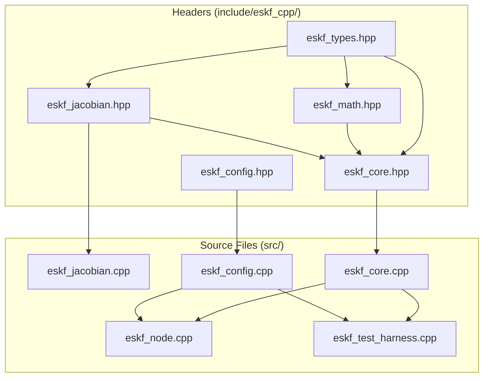

# ESKF C++ Code Documentation

A complete walkthrough of the Error-State Kalman Filter implementation for users not familiar with C++.

---

## File Overview



---

## 1. eskf_types.hpp — Data Type Definitions

**Purpose:** Defines all the data structures and constants used throughout the filter.

**Key Structures:**

| Structure | What It Stores | Size |
|-----------|---------------|------|
| `NominalState` | Main filter state | 18×1 vector |
| `ErrorState` | Error/correction state | 17×1 vector |
| `ErrorCovariance` | Uncertainty matrix | 17×17 matrix |
| `ESKFParams` | Configuration parameters | struct |
| `IMUMeasurement` | Gyro + accelerometer data | 3+3 vectors |
| `StateHistoryEntry` | Past state + covariance | for delayed measurements |

**State Vector Contents:**

```
Nominal State (18 elements):
┌─────────────────────────────────────────────────────────┐
│ q[0-3]     │ Quaternion (attitude)        │ 4 elements │
│ pr[4-6]    │ Relative position            │ 3 elements │
│ vr[7-9]    │ Relative velocity            │ 3 elements │
│ pbar[10-11]│ Image coordinates            │ 2 elements │
│ bgyr[12-14]│ Gyroscope bias               │ 3 elements │
│ bacc[15-17]│ Accelerometer bias           │ 3 elements │
└─────────────────────────────────────────────────────────┘
```

**Who uses this file:** EVERY other file includes this.

---

## 2. eskf_math.hpp — Math Utilities

**Purpose:** Provides mathematical functions for quaternion and rotation operations.

**Key Functions:**

| Function | Input → Output | What It Does |
|----------|----------------|--------------|
| `skew(v)` | Vector3d → Matrix3x3 | Creates cross-product matrix |
| `expQuaternion(δθ)` | Vector3d → Quaternion | Converts rotation vector to quaternion |
| `expRotation(φ)` | Vector3d → Matrix3x3 | Rodrigues formula for rotation |
| `quaternionMultiply(q1, q2)` | 2 Quaternions → Quaternion | Combine rotations |
| `quaternionToRotation(q)` | Quaternion → Matrix3x3 | Convert to rotation matrix |
| `computeLv(px, py, z)` | Floats → Matrix2x3 | IBVS velocity Jacobian |
| `computeLw(px, py)` | Floats → Matrix2x3 | IBVS angular velocity Jacobian |
| `computeDiscreteProcessNoise(params)` | ESKFParams → Matrix12x12 | Build noise covariance |

**Who calls this:** `eskf_core.cpp`, `eskf_jacobian.cpp`

---

## 3. eskf_jacobian.hpp / .cpp — Jacobian Computation

**Purpose:** Computes the mathematical matrices needed for state propagation.

**What Are Jacobians?**  
Jacobians are matrices that describe how small changes in one variable affect another. The ESKF needs:

| Matrix | Size | Purpose |
|--------|------|---------|
| `Fc` | 17×17 | How error state evolves over time (continuous) |
| `Gc` | 17×12 | How noise affects error state (continuous) |
| `Fd` | 17×17 | Discretized version of Fc |
| `Gd` | 17×12 | Discretized version of Gc |

**Main Function:**
```
computeESKFJacobians(x_nominal, omega_meas, a_meas, dt, R_b2c)
    └── Returns: ESKFJacobians struct with {Fc, Gc, Fd, Gd}
```

**Who calls this:** `eskf_core.cpp` → `predict()` function

---

## 4. eskf_config.hpp / .cpp — Configuration Loader

**Purpose:** Reads the YAML configuration file and fills the `ESKFParams` structure.

**Key Functions:**

| Function | What It Does |
|----------|--------------|
| `loadConfig(filename)` | Reads YAML file, returns `ESKFParams` |
| `loadConfigFromString(yaml_str)` | Parses YAML string directly |
| `printConfig(params)` | Prints all parameters to console |

**YAML File Structure:**
```yaml
timing:
  imu_rate_hz: 200
  eskf_rate_hz: 200
  image_delay_ms: 80

imu_noise:
  sigma_omega_n: 0.01
  sigma_a_n: 0.1
  ...

measurement_noise:
  image_sigma: 0.005
  radar_pos_sigma: 1.0
  radar_vel_sigma: 0.5
```

**Who calls this:** `eskf_node.cpp` (at startup)

---

## 5. eskf_core.hpp / .cpp — The Main Filter

**Purpose:** This is the heart of the ESKF. Contains all the filter logic.

### Class: `ErrorStateKalmanFilter`

#### Constructor
```cpp
ErrorStateKalmanFilter(params)
```
- Initializes state to zeros, covariance to initial uncertainty
- Sets up measurement noise matrices
- Creates empty history buffer

#### Main Methods (in execution order):

**1. `accumulateIMU(omega, accel)`**
- **Called by:** Node's IMU callback (200 Hz)
- **Purpose:** Collects and averages IMU measurements
- **Why:** ESKF may run slower than IMU rate

**2. `getAveragedIMU()`**
- **Called by:** Node before prediction
- **Purpose:** Get average of accumulated IMU samples
- **Returns:** Single averaged `IMUMeasurement`

**3. `predict(omega, accel, timestamp)`**
- **Called by:** Node after accumulating enough IMU samples
- **Purpose:** Main prediction step
- **Steps:**
  1. Subtract bias from IMU measurements
  2. Call `predictNominalState()` to propagate state
  3. Call `computeESKFJacobians()` to get Fd, Gd
  4. Propagate covariance: `P = Fd * P * Fd' + Gd * Qd * Gd'`
  5. Save to history buffer

**4. `correctImage(z_pbar, delay_steps)`**
- **Called by:** Node's image callback (30 Hz)
- **Purpose:** Apply image measurement with delay compensation
- **Steps:**
  1. Look up state from history at delayed time
  2. Compute innovation: `y = z - h(x)`
  3. Compute Kalman gain: `K = P * H' * inv(H*P*H' + R)`
  4. Compute error state: `δx = K * y`
  5. Call `injectErrorState()` to correct state
  6. Call `repropagate()` to bring state to current time

**5. `correctRadar(z_radar)`**
- **Called by:** Node's radar callback (0.5 Hz)
- **Purpose:** Apply radar measurement (no delay)
- **Simpler** than image correction (no history lookup)

#### Private Helper Methods:

| Method | Purpose |
|--------|---------|
| `predictNominalState()` | Propagate state forward in time |
| `injectErrorState()` | Add error correction to nominal state |
| `resetCovariance()` | Adjust covariance after correction |
| `repropagate()` | Re-run prediction from corrected past state |
| `updateHistory()` | Store current state in history buffer |

---

## 6. eskf_node.cpp — ROS2 Interface

**Purpose:** Connects the ESKF filter to ROS2 topics.

### Class: `ESKFNode`

#### Constructor
```cpp
ESKFNode()
```
1. Declares ROS2 parameters (topic names, config file)
2. Calls `loadConfig()` to read YAML
3. Creates `ErrorStateKalmanFilter` instance
4. Sets up 3 subscribers and 1 publisher
5. Creates diagnostics timer (1 Hz)

#### Callbacks (Event-Driven):

**`imuCallback(msg)`** — Runs at ~200 Hz
```
IMU Message Received
    │
    ├─→ Extract omega and accel from message
    ├─→ Call eskf_->accumulateIMU(omega, accel)
    ├─→ imu_count_++
    │
    └─→ if (imu_count_ >= samples_per_eskf_)
            ├─→ Call eskf_->getAveragedIMU()
            ├─→ Call eskf_->predict(omega, accel, time)
            ├─→ Call publishPose()
            └─→ Reset imu_count_ = 0
```

**`imageCallback(msg)`** — Runs at ~30 Hz
```
Image Message Received
    │
    ├─→ Extract z_pbar from message.x, message.y
    └─→ Call eskf_->correctImage(z_pbar, delay_steps_)
```

**`radarCallback(msg)`** — Runs at ~0.5 Hz
```
Radar Message Received
    │
    ├─→ Build z_radar (6D: position + velocity)
    └─→ Call eskf_->correctRadar(z_radar)
```

**`publishPose()`** — Called after each prediction
```
Publish Pose
    │
    ├─→ Get quaternion and position from ESKF
    ├─→ Build PoseWithCovarianceStamped message
    └─→ Publish to /eskf/pose
```

---

## 7. eskf_test_harness.cpp — Standalone Tester

**Purpose:** Tests the ESKF without ROS2 using simulated data.

### What It Does:
1. Loads configuration from YAML
2. Creates a simulated drone trajectory
3. Simulates IMU, image, and radar measurements with noise
4. Runs ESKF for 25 seconds
5. Computes error metrics (RMSE)
6. Saves results to CSV file

### Key Classes:
- `IMUSimulator` — Generates noisy IMU data with evolving biases
- `TrueState` — Tracks the "ground truth" state

**Not needed for real operation** — only for validation.

---

## Complete Call Graph

```
┌────────────────────────── STARTUP ──────────────────────────┐
│                                                              │
│  main()                                                      │
│    └─→ ESKFNode()                                            │
│          ├─→ loadConfig() ← eskf_config.cpp                 │
│          ├─→ ErrorStateKalmanFilter() ← eskf_core.cpp       │
│          │      └─→ createInitialCovariance()               │
│          │      └─→ computeDiscreteProcessNoise()           │
│          └─→ create subscribers/publishers                   │
│                                                              │
└──────────────────────────────────────────────────────────────┘

┌────────────────────── RUNTIME LOOP ─────────────────────────┐
│                                                              │
│  ROS2 spins, waiting for messages...                        │
│                                                              │
│  ┌── IMU Message (200 Hz) ───────────────────────────────┐  │
│  │                                                        │  │
│  │  imuCallback()                                         │  │
│  │    └─→ accumulateIMU()                                 │  │
│  │    └─→ if ready: predict()                             │  │
│  │              ├─→ predictNominalState()                 │  │
│  │              ├─→ computeESKFJacobians()                │  │
│  │              │      └─→ skew(), expRotation()...       │  │
│  │              └─→ updateHistory()                       │  │
│  │    └─→ publishPose()                                   │  │
│  │                                                        │  │
│  └────────────────────────────────────────────────────────┘  │
│                                                              │
│  ┌── Image Message (30 Hz) ──────────────────────────────┐  │
│  │                                                        │  │
│  │  imageCallback()                                       │  │
│  │    └─→ correctImage()                                  │  │
│  │          ├─→ lookup history[delay_steps]               │  │
│  │          ├─→ compute Kalman gain                       │  │
│  │          ├─→ injectErrorState()                        │  │
│  │          ├─→ resetCovariance()                         │  │
│  │          └─→ repropagate()                             │  │
│  │                └─→ predict() for each missed step      │  │
│  │                                                        │  │
│  └────────────────────────────────────────────────────────┘  │
│                                                              │
│  ┌── Radar Message (0.5 Hz) ─────────────────────────────┐  │
│  │                                                        │  │
│  │  radarCallback()                                       │  │
│  │    └─→ correctRadar()                                  │  │
│  │          ├─→ compute Kalman gain                       │  │
│  │          ├─→ injectErrorState()                        │  │
│  │          └─→ resetCovariance()                         │  │
│  │                                                        │  │
│  └────────────────────────────────────────────────────────┘  │
│                                                              │
└──────────────────────────────────────────────────────────────┘
```

---

## Quick Reference: What File Does What

| File | One-Line Summary |
|------|------------------|
| `eskf_types.hpp` | Defines data types (vectors, matrices, structs) |
| `eskf_math.hpp` | Math utilities (quaternions, rotations, IBVS) |
| `eskf_jacobian.hpp/.cpp` | Computes Jacobian matrices for prediction |
| `eskf_config.hpp/.cpp` | Loads and parses YAML configuration |
| `eskf_core.hpp/.cpp` | **Main filter** — predict, correct, state management |
| `eskf_node.cpp` | ROS2 wrapper — subscribes/publishes topics |
| `eskf_test_harness.cpp` | Standalone test with simulated data |
